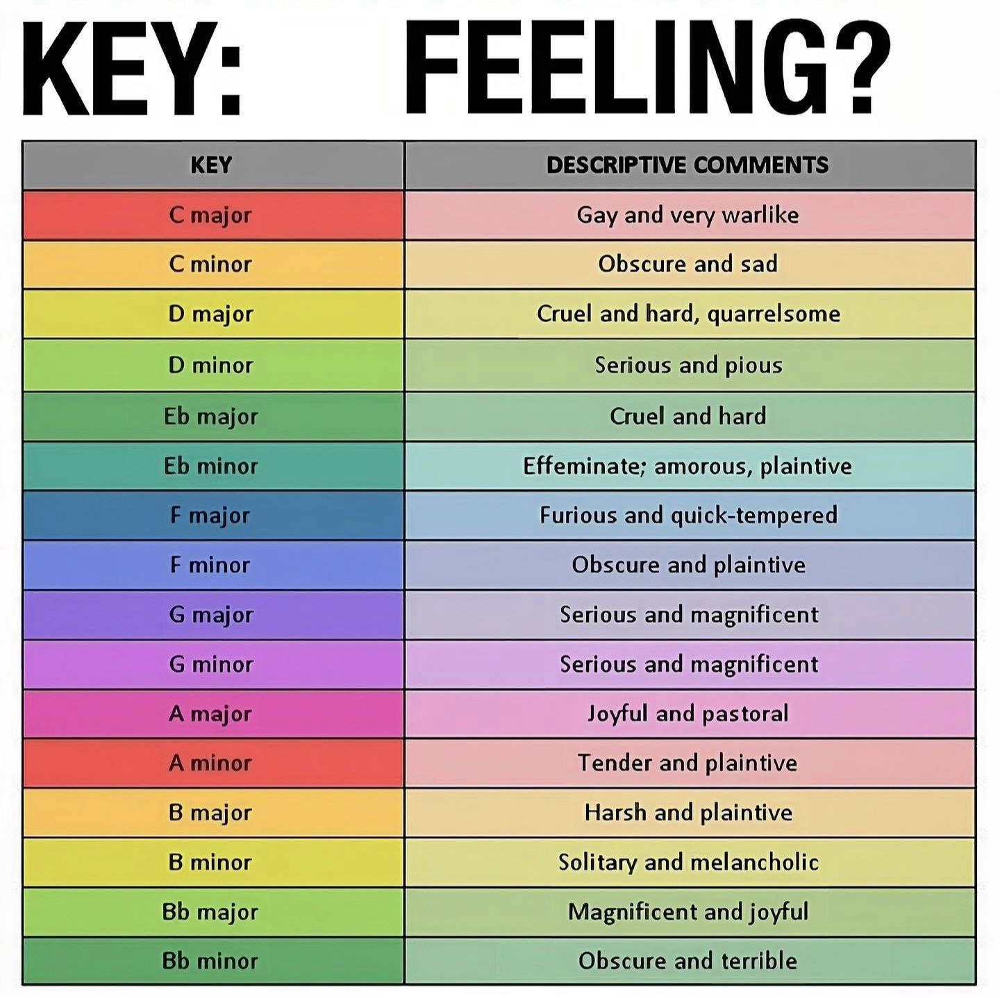

# Analyse des differentes tonalités des thèmes musicaux en fonction de leur jeu

## Jeux et Genres étudiés

| Genre | Jeux |
|-------|------|
| Horreur | Silent Hill, FNAF |
| Chill | Powerwash Simulator, Needle Game, Meccha Camaleon |
| RPG | Zelda, God of War, Clair Obscur, Undertale |
| Sandbox | Minecraft, Stardew Valley, Animal Crossing |

## Stats recherchées

